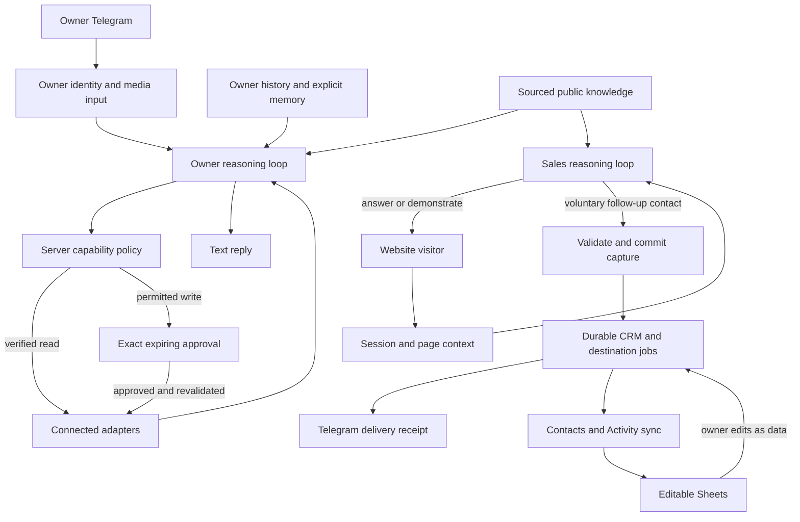

# Mia v2 — living project context

Updated: 2026-09-11. Local checks and independent review passed. Authorized deployment in progress.

Resumed from HANDOFF.md with Luna repair workers and fresh HEAVY release review.
TASKS.md tracks current gates. The stopped-session handoff is historical context.

## Accepted product and architecture

Current conversation defines v2; old memories/docs are background. Simplify the
existing FastAPI/SQLAlchemy app into private Telegram and public website reasoning
loops with shared adapters, knowledge, history, policy, CRM and reliable delivery.
Hebrew default; adapt to the conversation language. Voice/image input, text output.
OpenAI primary, Gemini fallback per purpose. Runtime model IDs stay configurable;
Codex development tiers are defined only in AGENTS.md.

## Contracts

### Telegram

Free conversation with sourced knowledge, history and dynamic discovery within
active owner Composio connections. Authenticate numeric owner before providers.
Verified reads run directly; unknown effects never become reads by inference.
All external CRM/Sheets/calendar/Gmail draft and permitted send writes are exact
proposals first. Each proposal has a distinct ID, immutable parameters, target
snapshot, 24-hour expiry and correctly bound buttons. Execution revalidates actor,
policy, connection, schema, current target and duplicate protection. Changed targets
need new approval. Reconcile unknown outcomes before retry. Prohibited actions stay
blocked regardless of approval. Internal history and explicit remember requests are
preauthorized; remove passive extraction from every entrypoint. Explicit memories
are sourced/idempotent; corrections supersede earlier records.

### Website

Model chooses answers, demonstrations, useful questions and appropriate handoff;
no fixed ladder, mandatory question count or paraphrase overrides. Use known context,
avoid repeating discovery and ground prices/capabilities in public website sources.
Only public knowledge and narrow session-bound lead submission are exposed.
Actual voluntary contact supplied for follow-up triggers capture without another
confirmation. Backend validates input/intent and owns saved/sent status.
Keep widget routes/response fields; add client-message dedup and v2 session credentials.
Possessing a phone/email never grants access to another visitor's history.

The website widget is being redesigned as a complete Hebrew/RTL chat panel, using
Mia's navy/blue identity, a branded header, readable conversation bubbles, a fixed
send/voice composer and responsive mobile sizing. Decoration stays subtle and all
styles stay scoped to the embed. Preserve credentials, deduplication, history and
lead behavior. Desktop/mobile browser inspection and behavioral checks are required.

### CRM and delivery

Database owns contacts, normalized identities, activity, synchronization snapshots
and destination jobs. Stable contact IDs differ from lead/session IDs. Preserve
Contacts A:N and Activity A:E. Append Contacts O `מזהה מיה`; Activity F
`מזהה פעילות` for new events. Bootstrap existing valid Contacts without clearing
or stopping at the first 100 rows. Import owner edits every 60 seconds and before
relevant CRM operations. Three-way per-field merge against last synchronized values:
merge disjoint changes, pause same-field conflicts for owner resolution. Serialize
with DB revisions/locks. Missing rows/identity collisions create issues, not deletion
or silent merge. Generic CRM-tab writes use this same service. Sheet text is data,
never instruction, authorization or memory input.

Commit contact, conversation link and independent delivery jobs before acknowledging
capture. Poll durable jobs every 5 seconds using DB leases. Track pending/in-flight/
confirmed/failed/unknown/conflict per destination; reuse Telegram receipt authority
and stable Activity event IDs. Reconcile uncertain outcomes before repeat effects.
The lead brief includes contact, known business context, summary and suggested next
step. Background callbacks alone are not durable delivery storage.

### Providers, history and knowledge

Both v2 loops use OpenAI Responses with separate Gemini text/tools/vision fallback.
Add dedicated Gemini transcription after OpenAI STT failure. Preserve captions,
audio provenance and uncertain transcription details. Keep provider continuation
formats separate, normalize history/tool results and never replay completed effects.
Bound calls and report truthful errors. Canonical history and site state survive
restart. Public knowledge is separate from owner memory; refresh existing public
website sources on request. Keep historical records without promoting them into v2
system instructions. No TTS, no new CRM UI; manual WhatsApp contact stays available.

## Current implementation

The private owner and public website loops are implemented. Numeric-owner auth,
credentialed session isolation, explicit memory, purpose-specific provider fallback,
immutable 24-hour approvals and backend action authority remain enforced. Typed
Gmail/Sheets/Calendar actions bind connections and target state. Calendar execution
uses proposal-derived stable IDs and carries approved location. Vision descriptions
cannot authorize memory; raw authenticated captions are handled separately.

CRM contacts, identities, conversation links, activity, snapshots, conflicts and
per-destination outbox jobs are durable. Three-way field merge and PostgreSQL
serialization preserve concurrent edits. An established Sheet row that disappears
creates a conflict; it is not silently recreated. Imported content remains data.

Website sessions hash credentials, lock state updates and deduplicate client
messages. Contact capture persists independent destination jobs in the transaction.
Whole-input consent classification and exact input evidence guard capture. A separate
structured narrative check validates proposed effect claims against backend state,
with fail-closed uncertainty and one bounded action-free regeneration. Real model
quality remains a live acceptance gate.

The scoped navy/blue Hebrew/RTL widget is implemented. API-generated UUID sessions,
credentials, bounded stale-session recovery, deduplication and history reload work
in the local real-API fixture. Current-tree desktop/mobile/small/short viewport checks passed. Manual WhatsApp remains.

## Cleanup and preservation

Retired WhatsApp/Baileys ingress/services, client graph/orchestrator, deterministic
site ladder/reply engines, passive extraction, scripted sales evaluations and owner
reply overrides are removed. Historical serialization and required migrations remain.
The initial 93-path dirty baseline is immutable under `.cache/mia-v2-baseline/`;
preexisting user deletions must not be attributed to new cleanup. Obsolete tests are
ported or retired only with retained behavioral coverage. No reset/clean/restore.

`.env` is not inspected. Production secrets remain in Secrets Manager; release
normalization removes obsolete task references without deleting secrets. The old
`.pytest_tmp_migrate_crm/` ACL issue stays excluded from Git/runtime packaging.

## Current release gates

Local release acceptance passed on 2026-09-11: 1,991 tests passed, zero failures,
errors or skips (104.6s), including isolated PostgreSQL. Ruff, widget behavior,
origin binding, four viewport visual checks, real API/widget credential/history/
capture checks, and settled-source nonroot container startup passed. All 45
migration records are present in the isolated test database; repeat applies zero.

Fresh independent HEAVY review has no unresolved findings in the assigned release,
production repair and test-port scopes. It accepted callback kill-switch ordering,
whole-input contact consent, truthful widget status, per-contact queue fairness
including issue-blocked pagination, Meta mutation denial, durable reminder claims,
retired task-binding removal, credentialed probes and restored freshness coverage.
New evidence is under `.cache/mia-v2-release/`.

Cleanup inventory: 179 deleted paths, comprising 66 preexisting user deletions and
113 implementation cleanup deletions. The initial 93-path dirty baseline remains
preserved. No unrelated reset/clean/restore occurred. Exact-SHA CI/image, migration,
rollout and user live acceptance remain distinct gates.
## Authorized deployment

The user authorized completion, cleanup, tests, independent review, deployment and
AWS authentication, then their own live testing. Current authentication was verified.
Production is freshly observed on stable ECS mia:57 in eu-north-1 with old image
mia:31 and commit `58b40b341c992508349e23cdc55d3cc5f456c41b`, schema
`20260905_ai_runs_occurred_at.sql`; no v2 rollout has occurred.

After local acceptance: reviewed commit/PR, exact-SHA CI, production image with
matching SHA label/environment, scan and immutable ECR digest. Both existing
schedulers target the latest family revision, so pause them before registration.
Register from the actual healthy serving base, migrate and roll out, keep reconcile
disabled and enable owner due scan pinned to the accepted revision. Verify serving image,
SHA/schema, health, routes, provider configuration and worker readiness. Preserve
rollback task/image. Production values and readiness must be freshly observed.

## User live acceptance

- Telegram natural conversation, Hebrew voice/image/caption understanding, explicit
  memory and provider fallback without duplicate effects.
- Exact approve/reject, expiration, changed target, simultaneous proposals and
  repeated callbacks; no unintended write from ordinary discussion or pasted data.
- Website exploration, grounded pricing, useful examples, voluntary follow-up
  contact, continued conversation and reload history without repeated discovery.
- Telegram lead brief, Contacts/Activity rows, owner edits, reordered rows,
  same-field conflict and destination retry/recovery behavior.

User/device/model acceptance follows deployment. Never infer it from local mocks,
CI success or configuration-only health. TASKS.md owns the current execution plan.
